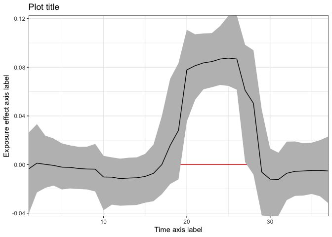
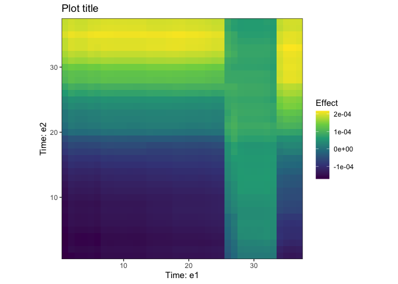

<!-- README.md is generated from README.Rmd. Please edit that file -->

# dlmtree

`dlmtree` is an R package that provides constrained distributed lag
models (DLMs) using a regression tree approach within the Bayesian
additive regression trees (BART) framework, referred to as treed DLMs.
The package includes various extensions of treed DLMs, allowing for the
incorporation of different scenarios like linear, non-linear
associations, mixture exposures, and heterogeneous exposure effects. The
package is built user-friendly with a single function with three
arguments to specify treed DLMs. Functions for summarizing the model fit
and visualization are also provided.

<!-- badges: start -->
<!-- badges: end -->

## Models

| Model                                                   |  DLM type  |  Family  | Mixture | Heterogeneity |
|:--------------------------------------------------------|:----------:|:--------:|:-------:|:-------------:|
| Treed distributed lag model (TDLM)                      |   Linear   | Gaussian |    X    |       X       |
|                                                         |            |  Binary  |    X    |       X       |
|                                                         |            |  Count   |    X    |       X       |
| Treed distributed lag mixture model (TDLMM)             |   Linear   | Gaussian |    O    |       X       |
|                                                         |            |  Binary  |    O    |       X       |
|                                                         |            |  Count   |    O    |       X       |
| Treed distributed non-linear lag model (TDLNM)          | Non-linear | Gaussian |    X    |       X       |
|                                                         |            |  Binary  |    X    |       X       |
| Heterogeneous distributed lag model (HDLM)              |   Linear   | Gaussian |    X    |       O       |
| Heterogeneous distributed lag mixture model (HDLMM)     |   Linear   | Gaussian |    O    |       O       |
| Zero-inflated monotone regression tree (TDLNM-monotone) |  Monotone  | Gaussian |    X    |       X       |
|                                                         |            |  Binary  |    X    |       X       |

## Installation

Installing package from [GitHub](https://github.com/):

``` r
# install.packages("devtools")
devtools::install_github("danielmork/dlmtree")
library(dlmtree)
```

<!-- Installing package from CRAN with: -->
<!-- ``` r -->
<!-- install.packages("dlmtree") -->
<!-- library(dlmtree) -->
<!-- ``` -->

## Examples

``` r
set.seed(1)
library(dlmtree)
```

### TDLM

- Fitting the model

``` r
D <- sim.tdlmm(sim = "A", mean.p = 0.5, n = 5000)
fit <- dlmtree(formula = y ~ .,
               data = D$dat,
               exposure.data = D$exposures[["e1"]],
               dlm.type = "linear", 
               family = "logit",
               n.burn = 2500, n.iter = 5000, n.thin = 5)
```

    > Preparing data...
    > 
    > Running TDLM:
    > Burn-in % complete 
    > [0--------25--------50--------75--------100]
    >  ''''''''''''''''''''''''''''''''''''''''''
    > MCMC iterations (est time: 20 seconds)
    > [0--------25--------50--------75--------100]
    >  ''''''''''''''''''''''''''''''''''''''''''
    > Compiling results...

- Summary of the model fit

``` r
fit_sum <- summary(fit)
fit_sum
```

    > ---
    > TDLM summary
    > 
    > Model run info:
    > - y ~ . 
    > - family: logit 
    > - 20 trees
    > - 2500 burn-in iterations
    > - 5000 post-burn iterations
    > - 5 thinning factor
    > - 0.95 confidence level
    > 
    > Fixed effect coefficients:
    >               Mean  Lower Upper
    > (Intercept) -0.004 -0.144 0.137
    > c1          -0.024 -0.078 0.030
    > c2          -0.040 -0.098 0.015
    > c3          -0.005 -0.061 0.057
    > c4          -0.014 -0.071 0.043
    > c5           0.028 -0.028 0.085
    > b1          -0.006 -0.119 0.107
    > b2          -0.022 -0.139 0.095
    > b3           0.027 -0.092 0.134
    > b4           0.035 -0.081 0.146
    > b5           0.019 -0.088 0.129
    > ---
    > * = CI does not contain zero
    > 
    > DLM effect:
    > range = [-0.012, 0.088]
    > signal-to-noise = 0.155
    > critical windows: 20-27 
    >              Mean  Lower Upper
    > Period 1   -0.004 -0.041 0.026
    > Period 2    0.001 -0.023 0.033
    > Period 3    0.000 -0.019 0.024
    > Period 4   -0.001 -0.017 0.021
    > Period 5   -0.002 -0.020 0.017
    > Period 6   -0.002 -0.020 0.016
    > Period 7   -0.003 -0.020 0.015
    > Period 8   -0.004 -0.020 0.015
    > Period 9   -0.004 -0.022 0.017
    > Period 10  -0.010 -0.038 0.007
    > Period 11  -0.010 -0.033 0.006
    > Period 12  -0.012 -0.034 0.005
    > Period 13  -0.011 -0.034 0.006
    > Period 14  -0.011 -0.033 0.006
    > Period 15  -0.010 -0.031 0.009
    > Period 16  -0.007 -0.030 0.016
    > Period 17   0.000 -0.024 0.040
    > Period 18   0.016 -0.016 0.071
    > Period 19   0.028 -0.012 0.083
    > *Period 20  0.078  0.035 0.111
    > *Period 21  0.081  0.053 0.107
    > *Period 22  0.084  0.062 0.108
    > *Period 23  0.085  0.064 0.108
    > *Period 24  0.087  0.065 0.114
    > *Period 25  0.088  0.065 0.122
    > *Period 26  0.087  0.062 0.123
    > *Period 27  0.061  0.002 0.098
    > Period 28   0.050 -0.008 0.094
    > Period 29  -0.006 -0.042 0.045
    > Period 30  -0.012 -0.043 0.013
    > Period 31  -0.012 -0.042 0.010
    > Period 32  -0.007 -0.029 0.019
    > Period 33  -0.006 -0.026 0.019
    > Period 34  -0.005 -0.026 0.017
    > Period 35  -0.005 -0.024 0.018
    > Period 36  -0.005 -0.026 0.020
    > Period 37  -0.005 -0.032 0.023
    > ---
    > * = CI does not contain zero

- Visualization

``` r
plot(fit_sum, main = "Plot title", xlab = "Time axis label", ylab = "Exposure effect axis label")
```



### TDLMM

- Fitting the model

``` r
D <- sim.tdlmm(sim = "A", mean.p = 0.5, n = 5000)
fit <- dlmtree(formula = y ~ .,
               data = D$dat,
               exposure.data = D$exposures,
               dlm.type = "linear", 
               family = "logit", 
               mixture = TRUE,
               binomial.size = 1,
               mixture.interactions = "noself",
               n.burn = 2500, n.iter = 5000, n.thin = 5)
```

    > Preparing data...
    > 
    > Running TDLMM:
    > Burn-in % complete 
    > [0--------25--------50--------75--------100]
    >  ''''''''''''''''''''''''''''''''''''''''''
    > MCMC iterations (est time: 1.4 minutes)
    > [0--------25--------50--------75--------100]
    >  ''''''''''''''''''''''''''''''''''''''''''
    > Compiling results...

- Summary of the model fit

``` r
fit_sum <- summary(fit)
```

    > Reconstructing main effects...
    > Reconstructing interaction effects...
    > 0%...25%...50%...75%...100%
    > Calculating marginal effects...
    > Calculating fixed effects...

``` r
fit_sum
```

    > ---
    > TDLMM summary
    > 
    > Model run info:
    > - y ~ . 
    > - family: logit 
    > - 20 trees (alpha = 0.95, beta = 2)
    > - 2500 burn-in iterations
    > - 5000 post-burn iterations
    > - 5 thinning factor
    > - 5 exposures measured at 37 time points
    > - 10 two-way interactions (no-self interactions)
    > - 1 kappa sparsity prior
    > - 0.95 confidence level
    > 
    > Fixed effects:
    >                Mean  Lower Upper
    >  (Intercept)  0.023 -0.135 0.172
    > *c1           0.070  0.013 0.127
    >  c2           0.027 -0.033 0.085
    >  c3          -0.006 -0.063 0.052
    >  c4           0.016 -0.042 0.074
    >  c5           0.015 -0.044 0.074
    >  b1          -0.020 -0.138 0.096
    >  b2          -0.019 -0.130 0.090
    >  b3          -0.002 -0.111 0.113
    >  b4          -0.064 -0.176 0.058
    >  b5           0.023 -0.095 0.134
    > ---
    > * = CI does not contain zero
    > 
    > --
    > Exposure effects: critical windows
    > * = Exposure selected by Bayes Factor
    > (x.xx) = Relative effect size
    > 
    >  *e1 (0.99): 27-33
    >  *e2 (0.36): 
    >  *e3 (0.31): 
    >  *e4 (0.49): 
    >  *e5 (0.34): 
    > --
    > Interaction effects: critical windows
    > 
    >  - No critical windows
    > ---

- Visualization

``` r
plot(fit_sum, exposure1 = "e1", main = "Plot title", xlab = "Time axis label", ylab = "Exposure effect axis label")
```


``` r
plot(fit_sum, exposure1 = "e1", exposure2 = "e2", main = "Plot title")
```



### TDLNM

- Fitting the model

``` r
D <- sim.tdlnm(sim = "A", error.to.signal = 1)
fit <- dlmtree(formula = y ~ .,
               data = D$dat,
               exposure.data = as.matrix(D$exposures),
               dlm.type = "nonlinear", 
               family = "gaussian",
               n.burn = 2500, n.iter = 5000, n.thin = 5)
```

    > Preparing data...
    > 
    > Running TDLNM:
    > Burn-in % complete 
    > [0--------25--------50--------75--------100]
    >  ''''''''''''''''''''''''''''''''''''''''''
    > MCMC iterations (est time: 2 seconds)
    > [0--------25--------50--------75--------100]
    >  ''''''''''''''''''''''''''''''''''''''''''
    > Compiling results...

- Summary of the model fit

``` r
fit_sum <- summary(fit)
```

    > Centered DLNM at exposure value 0

``` r
fit_sum
```

    > ---
    > TDLNM summary
    > 
    > Model run info:
    > - y ~ . 
    > - family: gaussian 
    > - 20 trees
    > - 2500 burn-in iterations
    > - 5000 post-burn iterations
    > - 5 thinning factor
    > - 0.95 confidence level
    > 
    > Fixed effect coefficients:
    >               Mean   Lower  Upper
    > (Intercept) -1.788 -10.798  6.762
    > *c1          0.707   0.608  0.809
    > *c2          1.110   1.004  1.208
    > *c3         -0.528  -0.627 -0.437
    > *c4         -2.136  -2.243 -2.037
    > *c5          0.244   0.141  0.344
    > *b1          0.905   0.706  1.104
    > *b2          2.200   1.996  2.398
    > *b3          0.917   0.713  1.109
    > *b4         -0.508  -0.714 -0.305
    > *b5         -1.333  -1.542 -1.135
    > ---
    > * = CI does not contain zero
    > 
    > DLNM effect:
    > range = [-1.032, 0.013]
    > signal-to-noise = 0.957
    > critical windows: 11-15

- Visualization

``` r
plot(fit_sum, main = "Plot title", xlab = "Time axis label", ylab = "Exposure-concentration axis label", flab = "Effect color label")
```


### HDLM

- Fitting the model

``` r
# Gaussian 
D <- sim.hdlmm(sim = "A", n = 5000)
fit <- dlmtree(y ~ ., 
               data = D$dat,
               exposure.data = D$exposure,
               dlm.type = "linear", 
               family = "gaussian", 
               het = TRUE,
               hdlm.dlmtree.type = "shared", # 'nested' is also an option
               n.burn = 2500, n.iter = 5000, n.thin = 5)
```

    > Preparing data...
    > 
    > Running shared HDLM:
    > Burn-in % complete 
    > [0--------25--------50--------75--------100]
    >  ''''''''''''''''''''''''''''''''''''''''''
    > MCMC iterations (est time: 34 seconds)
    > [0--------25--------50--------75--------100]
    >  ''''''''''''''''''''''''''''''''''''''''''
    > Compiling results...

- Summary of the model fit

``` r
fit_sum <- summary(fit)
fit_sum
```

    > ---
    > HDLM summary
    > 
    > Model run info:
    > - y ~ . 
    > - family: gaussian 
    > - 20 trees
    > - 2500 burn-in iterations
    > - 5000 post-burn iterations
    > - 5 thinning factor
    > - 0.5 modifier sparsity prior
    > - 0.95 confidence level
    > 
    > Fixed effects:
    >                Mean  Lower  Upper
    >  (Intercept) -0.010 -0.092  0.071
    > *mod_num     -0.223 -0.250 -0.194
    >  mod_bin      0.001 -0.053  0.056
    > *mod_scale   -0.769 -0.864 -0.677
    > *c1          -1.166 -1.195 -1.136
    > *c2          -0.447 -0.475 -0.420
    > *c3           0.216  0.189  0.244
    >  c4           0.027  0.000  0.055
    > *c5           0.628  0.602  0.655
    > *b1           0.562  0.506  0.617
    > *b2           0.887  0.831  0.939
    > *b3          -1.259 -1.318 -1.203
    > *b4           0.481  0.422  0.537
    > *b5          -1.497 -1.553 -1.441
    > ---
    > * = CI does not contain zero
    > 
    > Modifiers:
    >             PIP
    > mod_num   1.000
    > mod_bin   1.000
    > mod_scale 0.224
    > c1        0.241
    > c2        0.285
    > c3        0.384
    > c4        0.218
    > c5        0.321
    > b1        0.187
    > b2        0.197
    > b3        0.209
    > b4        0.255
    > b5        0.230
    > ---
    > PIP = Posterior inclusion probability
    > 
    > ---
    > To obtain exposure effect estimates, use the 'shiny(fit)' function.

- Launching Shiny app

``` r
# shiny(fit)
```

### HDLMM

- Fitting the model

``` r
# Gaussian
D <- sim.hdlmm(sim = "D", n = 5000)
fit <- dlmtree(formula = y ~ ., 
               data = D$dat,
               exposure.data = D$exposures,
               dlm.type = "linear", 
               family = "gaussian", 
               mixture = TRUE, 
               het = TRUE,
               mixture.interactions = "noself", 
               hdlm.modifiers = "all",
               n.burn = 2500, n.iter = 5000, n.thin = 5)
```

    > Preparing data...
    > 
    > Running HDLMM:
    > Burn-in % complete 
    > [0--------25--------50--------75--------100]
    >  ''''''''''''''''''''''''''''''''''''''''''
    > MCMC iterations (est time: 1.6 minutes)
    > [0--------25--------50--------75--------100]
    >  ''''''''''''''''''''''''''''''''''''''''''
    > Compiling results...

- Summary of the model fit

``` r
fit_sum <- summary(fit)
fit_sum
```

    > ---
    > HDLMM summary
    > 
    > Model run info:
    > - y ~ . 
    > - family: gaussian 
    > - 20 trees
    > - 2500 burn-in iterations
    > - 5000 post-burn iterations
    > - 5 thinning factor
    > - 3 exposures measured at 37 time points
    > - 3 two-way interactions (no-self interactions)
    > - 0.5 modifier sparsity prior
    > - 1 exposure sparsity prior
    > - 0.95 confidence level
    > 
    > Fixed effects:
    >                Mean  Lower  Upper
    >  (Intercept) -0.020 -0.138  0.094
    > *mod_num     -0.594 -0.639 -0.545
    > *mod_bin      0.392  0.325  0.465
    > *mod_scale    0.244  0.142  0.342
    > *c1           0.544  0.517  0.571
    > *c2           0.687  0.658  0.716
    > *c3           0.758  0.732  0.785
    > *c4          -0.658 -0.689 -0.631
    > *c5          -0.732 -0.760 -0.704
    > *b1           0.245  0.187  0.303
    > *b2          -1.514 -1.574 -1.454
    > *b3           0.134  0.078  0.197
    > *b4           0.804  0.748  0.857
    > *b5          -0.574 -0.635 -0.511
    > ---
    > * = CI does not contain zero
    > 
    > Modifiers:
    >             PIP
    > mod_num   1.000
    > mod_bin   1.000
    > mod_scale 0.577
    > c1        0.556
    > c2        0.538
    > c3        0.576
    > c4        0.534
    > c5        0.558
    > b1        0.587
    > b2        0.563
    > b3        0.581
    > b4        0.498
    > b5        0.561
    > ---
    > PIP = Posterior inclusion probability
    > 
    > ---
    > To obtain exposure effect estimates, use the 'shiny(fit)' function.

- Launching Shiny app

``` r
# shiny(fit)
```
