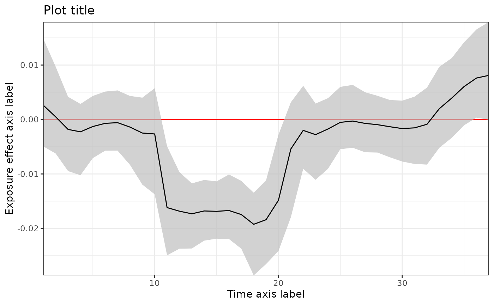

# TDLM

This vignette demonstrates the implementation of treed distributed lag
model (TDLM). More details can be found in Mork and Wilson (2023) \<doi:
[10.1111/biom.13568](https://doi.org/10.1111/biom.13568)\>.

``` r

library(dlmtree)
library(dplyr)
set.seed(1)
```

### Load data

Simulated data is available on
[GitHub](https://github.com/danielmork/dlmtree/tree/master/vignettes/articles).
It can be loaded with the following code.

``` r

sbd_dlmtree <- get_sbd_dlmtree()
```

### Data preparation

``` r

# Response and covariates
sbd_cov <- sbd_dlmtree %>% 
            select(bwgaz, ChildSex, MomAge, GestAge, MomPriorBMI, Race,
                    Hispanic, MomEdu, SmkAny, Marital, Income,
                    EstDateConcept, EstMonthConcept, EstYearConcept)

# Exposure data
sbd_exp <- list(PM25 = sbd_dlmtree %>% select(starts_with("pm25_")),
                TEMP = sbd_dlmtree %>% select(starts_with("temp_")),
                SO2 = sbd_dlmtree %>% select(starts_with("so2_")),
                CO = sbd_dlmtree %>% select(starts_with("co_")),
                NO2 = sbd_dlmtree %>% select(starts_with("no2_")))
sbd_exp <- sbd_exp %>% lapply(as.matrix)
```

### Fitting the model

``` r

tdlm.fit <- dlmtree(formula = bwgaz ~ ChildSex + MomAge + MomPriorBMI +
                      Race + Hispanic + SmkAny + EstMonthConcept,
                    data = sbd_cov,
                    exposure.data = sbd_exp[["PM25"]], # A single numeric matrix
                    family = "gaussian",
                    dlm.type = "linear",
                    control.mcmc = list(n.burn = 2500, n.iter = 10000, n.thin = 5))
```

    #> Preparing data...
    #> 
    #> Running TDLM:
    #> Burn-in % complete 
    #> [0--------25--------50--------75--------100]
    #>  ''''''''''''''''''''''''''''''''''''''''''
    #> MCMC iterations (est time: 28 seconds)
    #> [0--------25--------50--------75--------100]
    #>  ''''''''''''''''''''''''''''''''''''''''''
    #> Compiling results...

### Model fit summary

``` r

tdlm.sum <- summary(tdlm.fit)
print(tdlm.sum)
```

    #> ---
    #> TDLM summary
    #> 
    #> Model run info:
    #> - bwgaz ~ ChildSex + MomAge + MomPriorBMI + Race + Hispanic + SmkAny + EstMonthConcept 
    #> - sample size: 10,000 
    #> - family: gaussian 
    #> - 20 trees
    #> - 2500 burn-in iterations
    #> - 10000 post-burn iterations
    #> - 5 thinning factor
    #> - exposure measured at 37 time points
    #> - 0.95 confidence level
    #> 
    #> Fixed effect coefficients:
    #>                        Mean  Lower  Upper
    #> *(Intercept)          2.286  2.014  2.544
    #> *ChildSexM           -2.105 -2.125 -2.084
    #> MomAge                0.000 -0.001  0.002
    #> *MomPriorBMI         -0.021 -0.023 -0.019
    #> RaceAsianPI           0.066 -0.065  0.187
    #> RaceBlack             0.076 -0.051  0.201
    #> Racewhite             0.057 -0.065  0.178
    #> *HispanicNonHispanic  0.255  0.232  0.278
    #> *SmkAnyY             -0.403 -0.451 -0.357
    #> EstMonthConcept2     -0.049 -0.109  0.011
    #> *EstMonthConcept3    -0.143 -0.210 -0.080
    #> *EstMonthConcept4    -0.228 -0.294 -0.162
    #> *EstMonthConcept5    -0.205 -0.262 -0.148
    #> *EstMonthConcept6    -0.205 -0.258 -0.150
    #> EstMonthConcept7     -0.032 -0.086  0.024
    #> *EstMonthConcept8     0.145  0.083  0.206
    #> *EstMonthConcept9     0.394  0.329  0.461
    #> *EstMonthConcept10    0.372  0.307  0.439
    #> *EstMonthConcept11    0.332  0.271  0.389
    #> *EstMonthConcept12    0.131  0.077  0.185
    #> ---
    #> * = CI does not contain zero
    #> 
    #> DLM effect:
    #> range = [-0.019, 0.008]
    #> signal-to-noise = 0.021
    #> critical windows: 11-20,36 
    #>              Mean  Lower  Upper
    #> Period 1    0.003 -0.005  0.015
    #> Period 2    0.000 -0.006  0.010
    #> Period 3   -0.002 -0.009  0.004
    #> Period 4   -0.002 -0.010  0.003
    #> Period 5   -0.001 -0.007  0.004
    #> Period 6   -0.001 -0.006  0.005
    #> Period 7   -0.001 -0.006  0.005
    #> Period 8   -0.001 -0.008  0.004
    #> Period 9   -0.002 -0.012  0.004
    #> Period 10  -0.003 -0.014  0.006
    #> *Period 11 -0.016 -0.025 -0.005
    #> *Period 12 -0.017 -0.024 -0.010
    #> *Period 13 -0.017 -0.024 -0.012
    #> *Period 14 -0.017 -0.022 -0.011
    #> *Period 15 -0.017 -0.022 -0.011
    #> *Period 16 -0.017 -0.022 -0.010
    #> *Period 17 -0.017 -0.024 -0.011
    #> *Period 18 -0.019 -0.029 -0.013
    #> *Period 19 -0.018 -0.027 -0.011
    #> *Period 20 -0.015 -0.024 -0.003
    #> Period 21  -0.005 -0.018  0.003
    #> Period 22  -0.002 -0.009  0.006
    #> Period 23  -0.003 -0.011  0.003
    #> Period 24  -0.002 -0.009  0.004
    #> Period 25  -0.001 -0.005  0.006
    #> Period 26   0.000 -0.005  0.006
    #> Period 27  -0.001 -0.006  0.005
    #> Period 28  -0.001 -0.006  0.004
    #> Period 29  -0.001 -0.007  0.004
    #> Period 30  -0.002 -0.008  0.003
    #> Period 31  -0.002 -0.008  0.004
    #> Period 32  -0.001 -0.008  0.006
    #> Period 33   0.002 -0.005  0.010
    #> Period 34   0.004 -0.003  0.011
    #> Period 35   0.006 -0.001  0.014
    #> *Period 36  0.008  0.000  0.017
    #> Period 37   0.008  0.000  0.018
    #> ---
    #> * = CI does not contain zero
    #> 
    #> residual standard errors: 0.01
    #> ---

### Exposure effect

``` r

plot(tdlm.sum, 
     main = "Plot title", 
     xlab = "Time axis label", 
     ylab = "Exposure effect axis label")
```


