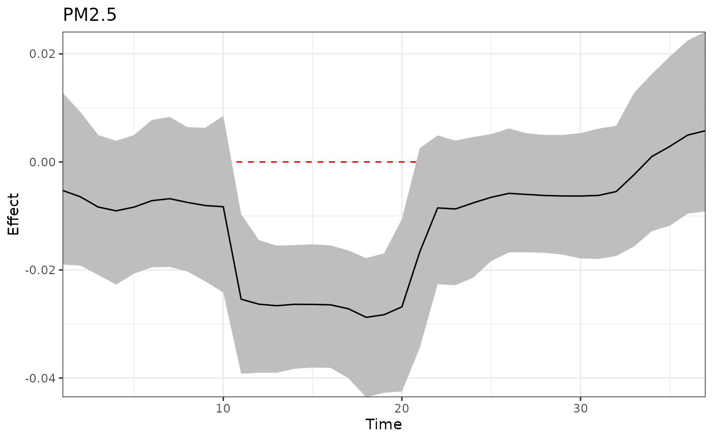
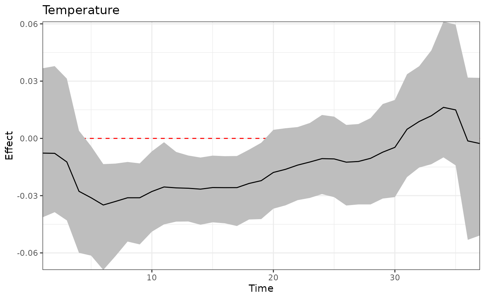
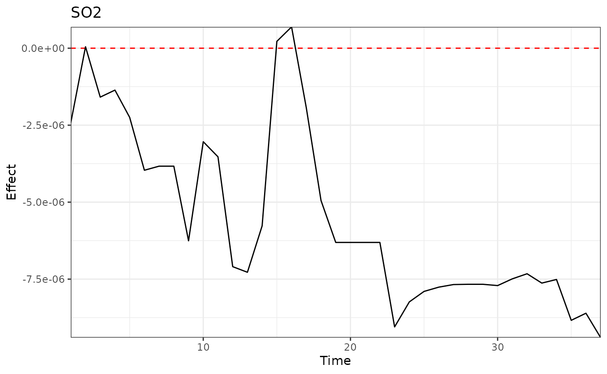
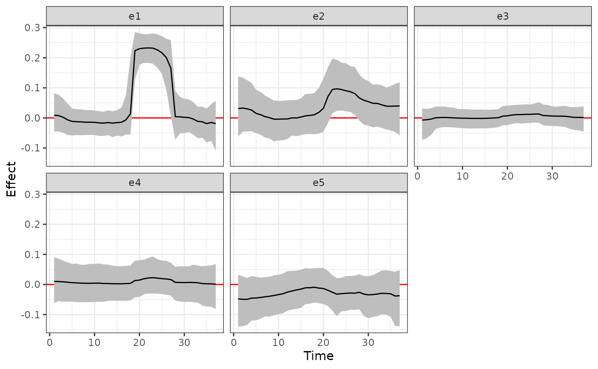
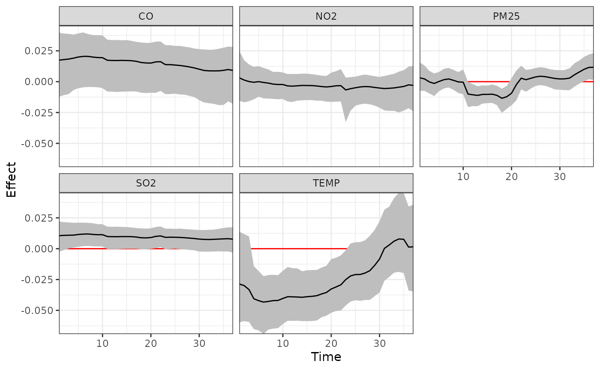

# TDLMM

This vignette demonstrates the implementation of treed distributed lag
mixture model (TDLMM). More details can be found in Mork and Wilson
(2023) \<doi:
[10.1111/biom.13568](https://doi.org/10.1111/biom.13568)\>.

``` r

library(dlmtree)
library(dplyr)
set.seed(1)
```

### Load data

Simulated data is available on
[GitHub](https://github.com/danielmork/dlmtree/tree/master/vignettes/articles).
It can be loaded with the following code.

``` r

sbd_dlmtree <- get_sbd_dlmtree()
```

### Data preparation

``` r

# Response and covariates
sbd_cov <- sbd_dlmtree %>% 
            select(bwgaz, ChildSex, MomAge, GestAge, MomPriorBMI, Race,
                    Hispanic, MomEdu, SmkAny, Marital, Income,
                    EstDateConcept, EstMonthConcept, EstYearConcept)

# Exposure data
sbd_exp <- list(PM25 = sbd_dlmtree %>% select(starts_with("pm25_")),
                TEMP = sbd_dlmtree %>% select(starts_with("temp_")),
                SO2 = sbd_dlmtree %>% select(starts_with("so2_")),
                CO = sbd_dlmtree %>% select(starts_with("co_")),
                NO2 = sbd_dlmtree %>% select(starts_with("no2_")))
sbd_exp <- sbd_exp %>% lapply(as.matrix)
```

### Fitting the model

``` r

tdlmm.fit <- dlmtree(formula = bwgaz ~ ChildSex + MomAge + MomPriorBMI +
                       Race + Hispanic + SmkAny + EstMonthConcept,
                     data = sbd_cov,
                     exposure.data = sbd_exp,
                     family = "gaussian",
                     dlm.type = "linear",
                     mixture = TRUE,
                     control.mix = list(interactions = "noself"),
                     control.mcmc = list(n.burn = 2500, n.iter = 10000, n.thin = 5))
#> Preparing data...
#> 
#> Running TDLMM:
#> Burn-in % complete 
#> [0--------25--------50--------75--------100]
#>  ''''''''''''''''''''''''''''''''''''''''''
#> MCMC iterations (est time: 3.1 minutes)
#> [0--------25--------50--------75--------100]
#>  ''''''''''''''''''''''''''''''''''''''''''
#> Compiling results...
```

### Model fit summary

``` r

# Marginalization with co-exposure fixed at exact levels for each exposure
tdlmm.sum.exact <- summary(tdlmm.fit, marginalize = c(3, 2, 1, 2, 1))
#> Specified co-exposure values:
#> - PM25 : 3
#> - TEMP : 2
#> - SO2 : 1
#> - CO : 2
#> - NO2 : 1
#> 
#> Reconstructing main effects...
#> Reconstructing interaction effects...
#> 0%...25%...50%...75%...100%
#> Calculating marginal effects...
#> Calculating fixed effects...

# Marginalization with co-exposure fixed at 25th percentile
tdlmm.sum.percentile <- summary(tdlmm.fit, marginalize = 25)
#> Specified co-exposure values:
#> - PM25 : 5.183927
#> - TEMP : 1.374847
#> - SO2 : 0.9961942
#> - CO : 2.09893
#> - NO2 : 1.872199
#> 
#> Reconstructing main effects...
#> Reconstructing interaction effects...
#> 0%...25%...50%...75%...100%
#> Calculating marginal effects...
#> Calculating fixed effects...

# Marginalization with co-exposure fixed at the empirical means (default)
tdlmm.sum <- summary(tdlmm.fit, marginalize = "mean", log10BF.crit = 0.5)
#> Specified co-exposure values:
#> - PM25 : 6.842084
#> - TEMP : 3.187414
#> - SO2 : 1.992197
#> - CO : 3.219101
#> - NO2 : 3.077839
#> 
#> Reconstructing main effects...
#> Reconstructing interaction effects...
#> 0%...25%...50%...75%...100%
#> Calculating marginal effects...
#> Calculating fixed effects...
print(tdlmm.sum)
#> ---
#> TDLMM summary
#> 
#> Model run info:
#> - bwgaz ~ ChildSex + MomAge + MomPriorBMI + Race + Hispanic + SmkAny + EstMonthConcept 
#> - sample size: 10,000 
#> - family: gaussian 
#> -  20  trees
#> - 2500 burn-in iterations
#> - 10000 post-burn iterations
#> - 5 thinning factor
#> - 5 exposures measured at 37 time points
#> - 10 two-way interactions (no-self interactions)
#> - kappa sparsity prior
#> - 0.95 confidence level
#> 
#> Fixed effects:
#>                        Mean  Lower  Upper
#> *(Intercept)          0.171  0.041  0.304
#> *ChildSexM           -2.063 -2.084 -2.042
#>  MomAge               0.001 -0.001  0.002
#> *MomPriorBMI         -0.020 -0.022 -0.019
#>  RaceAsianPI          0.026 -0.066  0.117
#>  RaceBlack            0.033 -0.059  0.130
#>  Racewhite            0.016 -0.069  0.106
#> *HispanicNonHispanic  0.247  0.224  0.270
#> *SmkAnyY             -0.394 -0.444 -0.344
#> *EstMonthConcept2     0.080  0.011  0.147
#> *EstMonthConcept3     0.119  0.025  0.210
#> *EstMonthConcept4     0.158  0.037  0.278
#> *EstMonthConcept5     0.235  0.106  0.372
#> *EstMonthConcept6     0.179  0.047  0.315
#> *EstMonthConcept7     0.223  0.094  0.364
#> *EstMonthConcept8     0.222  0.094  0.357
#> *EstMonthConcept9     0.320  0.196  0.445
#> *EstMonthConcept10    0.199  0.086  0.312
#> *EstMonthConcept11    0.131  0.035  0.229
#>  EstMonthConcept12   -0.002 -0.072  0.069
#> ---
#> * = CI does not contain zero
#> 
#> --
#> Exposure effects: critical windows
#> * = Exposure selected by Bayes Factor
#> (x.xx) = Relative effect size
#> 
#>  *PM25 (0.78): 4,11-20
#>  *TEMP (0.78): 4-21
#>  *NO2 (0.68): 9-14,17-18,23
#> --
#> Interaction effects: critical windows
#> 
#>  PM25/TEMP (0.95):
#>  11/5-17
#>  12/4-21
#>  13/4-21
#>  14/4-21
#>  15/4-21
#>  16/4-21
#>  17/4-21
#>  18/4-21
#>  19/4-21
#>  20/4-21
#> ---
#> residual standard errors: 0.005
```

### Main exposure effect

``` r

p1 <- plot(tdlmm.sum, exposure1 = "PM25", main = "PM2.5")
p2 <- plot(tdlmm.sum, exposure1 = "TEMP", main = "Temperature")
p3 <- plot(tdlmm.sum, exposure1 = "NO2", main = "NO2")

p1
```



``` r

p2
```



``` r

p3
```



### Lagged interaction effect

``` r

plot(tdlmm.sum, exposure1 = "PM25", exposure2 = "TEMP")
```



### Adjusting for expected changes in co-occurring exposures

Here we consider going from the 25th to the 75th percentile in each
exposure while adjusting for the expected changes in other exposures due
to their correlations with the exposure of interest.

``` r

library(ggplot2)
dlm_coexp <- adj_coexposure(sbd_exp, tdlmm.fit, contrast_perc = c(0.25, 0.75))
#>         PM25     TEMP       SO2       CO      NO2
#> 25% 5.183927 1.374847 0.9961942 2.098930 1.872199
#> 75% 6.187326 2.378621 1.9960009 3.096027 2.875369
#> 
#> Predicting PM25 at lower/upper values of PM25: 5.183927 6.187326
#> Predicting TEMP at lower/upper values of PM25: 1.886921 1.937889
#> Predicting SO2 at lower/upper values of PM25: 1.403909 1.672338
#> Predicting CO at lower/upper values of PM25: 2.477085 2.784547
#> Predicting NO2 at lower/upper values of PM25: 2.208032 2.409519
#> Predicting PM25 at lower/upper values of TEMP: 5.654899 5.701115
#> Predicting TEMP at lower/upper values of TEMP: 1.374847 2.378621
#> Predicting SO2 at lower/upper values of TEMP: 1.686905 1.353916
#> Predicting CO at lower/upper values of TEMP: 3.07044 2.314228
#> Predicting NO2 at lower/upper values of TEMP: 2.72529 1.952642
#> Predicting PM25 at lower/upper values of SO2: 5.589447 5.87508
#> Predicting TEMP at lower/upper values of SO2: 1.888874 1.841457
#> Predicting SO2 at lower/upper values of SO2: 0.9961942 1.996001
#> Predicting CO at lower/upper values of SO2: 2.446352 2.898562
#> Predicting NO2 at lower/upper values of SO2: 2.179354 2.554288
#> Predicting PM25 at lower/upper values of CO: 5.482744 5.85876
#> Predicting TEMP at lower/upper values of CO: 2.0984 1.659518
#> Predicting SO2 at lower/upper values of CO: 1.310125 1.617886
#> Predicting CO at lower/upper values of CO: 2.09893 3.096027
#> Predicting NO2 at lower/upper values of CO: 1.971065 2.673015
#> Predicting PM25 at lower/upper values of NO2: 5.529577 5.732295
#> Predicting TEMP at lower/upper values of NO2: 2.121927 1.660641
#> Predicting SO2 at lower/upper values of NO2: 1.297695 1.702796
#> Predicting CO at lower/upper values of NO2: 2.25247 2.968066
#> Predicting NO2 at lower/upper values of NO2: 1.872199 2.875369
ggplot(dlm_coexp, aes(x = Time, y = Effect, ymin = Lower, ymax = Upper)) +
  geom_hline(yintercept = 0, color = "red") +
  geom_ribbon(fill = "grey") +
  geom_line() +
  facet_wrap(~Name) +
  theme_bw() + 
  scale_x_continuous(expand = c(0, 0)) +
  scale_y_continuous(expand = c(0, 0))
```


