# TDLNM

This vignette demonstrates the implementation of treed distributed lag
non-linear model (TDLNM). More details can be found in Mork and Wilson
(2021) \<doi:
[10.1093/biostatistics/kxaa051](https://doi.org/10.1093/biostatistics/kxaa051)\>.

``` r

library(dlmtree)
library(dplyr)
set.seed(1)
```

### Load data

Simulated data is available on
[GitHub](https://github.com/danielmork/dlmtree/tree/master/vignettes/articles).
It can be loaded with the following code.

``` r

sbd_dlmtree <- get_sbd_dlmtree()
```

### Data preparation

``` r

# Response and covariates
sbd_cov <- sbd_dlmtree %>% 
            select(bwgaz, ChildSex, MomAge, GestAge, MomPriorBMI, Race,
                    Hispanic, MomEdu, SmkAny, Marital, Income,
                    EstDateConcept, EstMonthConcept, EstYearConcept)

# Exposure data
sbd_exp <- list(PM25 = sbd_dlmtree %>% select(starts_with("pm25_")),
                TEMP = sbd_dlmtree %>% select(starts_with("temp_")),
                SO2 = sbd_dlmtree %>% select(starts_with("so2_")),
                CO = sbd_dlmtree %>% select(starts_with("co_")),
                NO2 = sbd_dlmtree %>% select(starts_with("no2_")))
sbd_exp <- sbd_exp %>% lapply(as.matrix)
```

### Fitting the model

``` r

tdlnm.fit <- dlmtree(formula = bwgaz ~ ChildSex + MomAge + MomPriorBMI + 
                       Race + Hispanic + SmkAny + EstMonthConcept,
                     data = sbd_cov,
                     exposure.data = sbd_exp[["TEMP"]],
                     dlm.type = "nonlinear",
                     family = "gaussian",
                     control.tdlnm = list(exposure.splits = 20),
                     control.mcmc = list(n.burn = 2500, n.iter = 10000, n.thin = 5))
#> Preparing data...
#> 
#> Running TDLNM:
#> Burn-in % complete 
#> [0--------25--------50--------75--------100]
#>  ''''''''''''''''''''''''''''''''''''''''''
#> MCMC iterations (est time: 32 seconds)
#> [0--------25--------50--------75--------100]
#>  ''''''''''''''''''''''''''''''''''''''''''
#> Compiling results...
```

### Model fit summary

``` r

tdlnm.sum <- summary(tdlnm.fit)
#> Centered DLNM at exposure value 0
print(tdlnm.sum)
#> ---
#> TDLNM summary
#> 
#> Model run info:
#> - bwgaz ~ ChildSex + MomAge + MomPriorBMI + Race + Hispanic + SmkAny + EstMonthConcept 
#> - sample size: 10,000 
#> - family: gaussian 
#> - 20 trees
#> - 2500 burn-in iterations
#> - 10000 post-burn iterations
#> - 5 thinning factor
#> - exposure measured at 37 time points
#> - 0.95 confidence level
#> 
#> Fixed effect coefficients:
#>                        Mean  Lower  Upper
#> (Intercept)           0.170 -0.892  1.220
#> *ChildSexM           -2.106 -2.126 -2.086
#> MomAge                0.001 -0.001  0.002
#> *MomPriorBMI         -0.021 -0.022 -0.019
#> RaceAsianPI           0.026 -0.101  0.153
#> RaceBlack             0.033 -0.090  0.159
#> Racewhite             0.013 -0.111  0.133
#> *HispanicNonHispanic  0.256  0.234  0.278
#> *SmkAnyY             -0.397 -0.442 -0.349
#> *EstMonthConcept2     0.118  0.033  0.202
#> *EstMonthConcept3     0.233  0.100  0.364
#> *EstMonthConcept4     0.369  0.208  0.532
#> *EstMonthConcept5     0.496  0.325  0.671
#> *EstMonthConcept6     0.449  0.275  0.628
#> *EstMonthConcept7     0.384  0.210  0.559
#> *EstMonthConcept8     0.235  0.067  0.403
#> *EstMonthConcept9     0.260  0.099  0.430
#> *EstMonthConcept10    0.155  0.015  0.306
#> *EstMonthConcept11    0.125  0.016  0.234
#> EstMonthConcept12     0.019 -0.054  0.094
#> ---
#> * = CI does not contain zero
#> 
#> DLNM effect:
#> range = [-0.042, 0.058]
#> signal-to-noise = 0.405
#> critical windows: 1-7,10-34 
#> 
#> residual standard errors: 0.004
```

### Exposure-time surface

``` r

plot(tdlnm.sum, 
     main = "Plot title", 
     xlab = "Time axis label", 
     ylab = "Exposure-concentration axis label", 
     flab = "Effect color label")
```

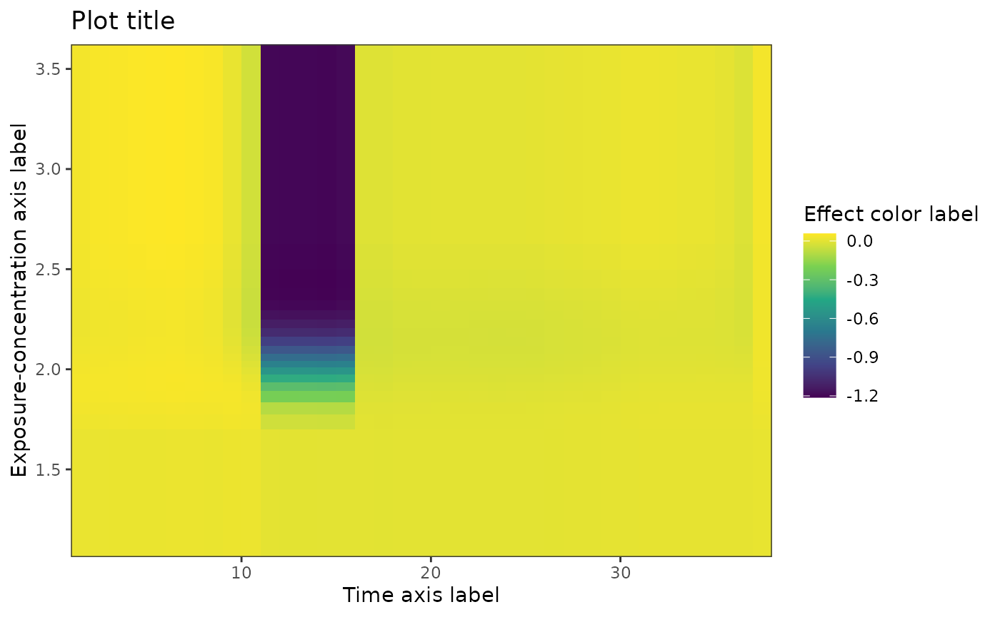

### Slicing on exposure-concentration

``` r

# slicing on exposure-concentration
plot(tdlnm.sum, plot.type = "slice", val = 1, main = "Slice at concentration 1") 
```

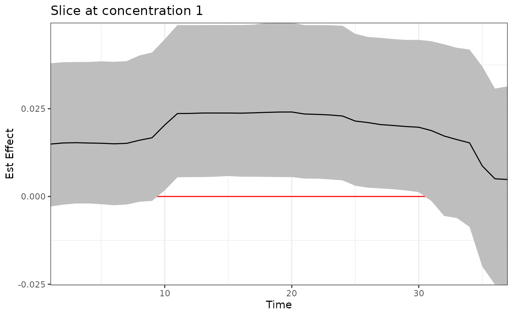

``` r

plot(tdlnm.sum, plot.type = "slice", val = 2, main = "Slice at concentration 2")
```

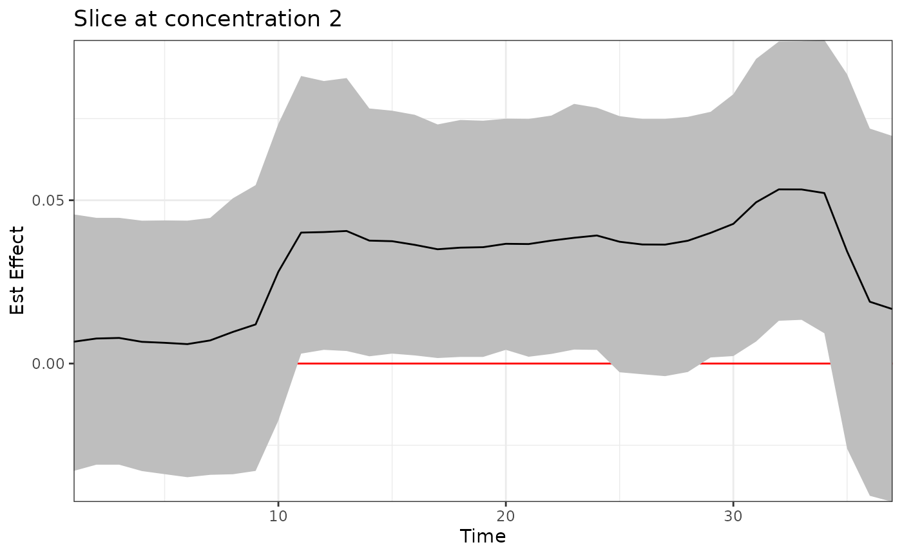

### Slicing on time lag

``` r

# slicing on exposure-concentration
plot(tdlnm.sum, plot.type = "slice", time = 7, main = "Slice at time 7")
```

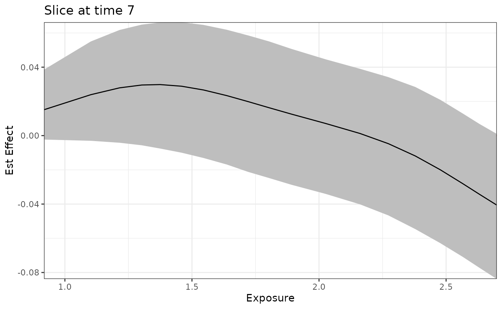

``` r

plot(tdlnm.sum, plot.type = "slice", time = 15, main = "Slice at time 15")
```

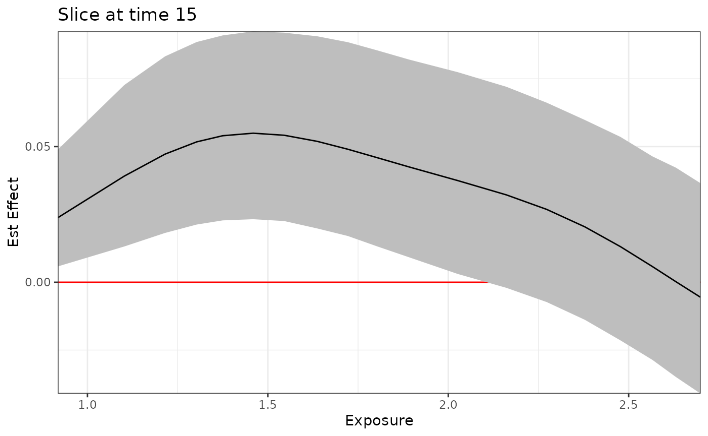

``` r

plot(tdlnm.sum, plot.type = "slice", time = 33, main = "Slice at time 33")
```

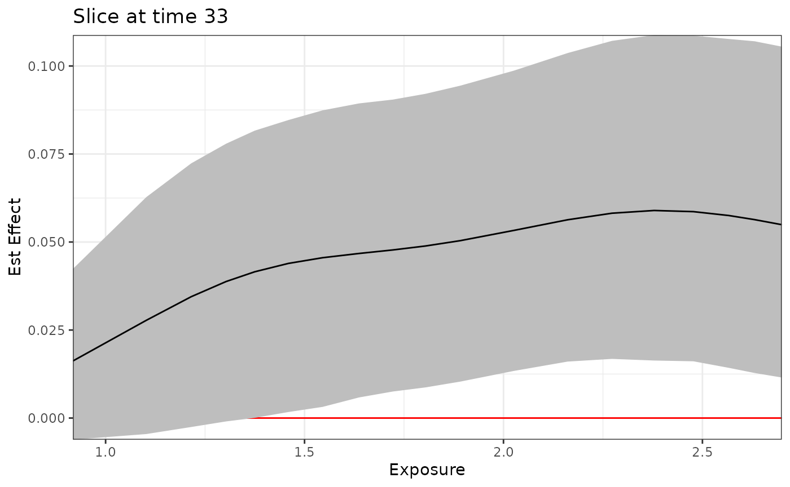

### different plot.type options

``` r

# Standard error, credible intervals
plot(tdlnm.sum, plot.type = "se", main = "Standard error")  
```

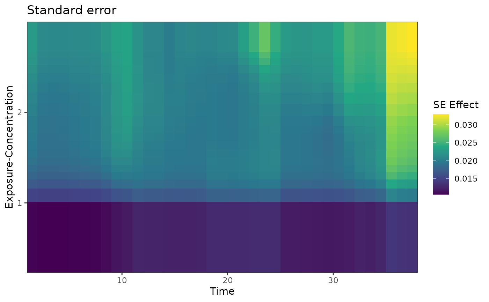

``` r

plot(tdlnm.sum, plot.type = "ci-min", main = "Credible interval lower bound")
```

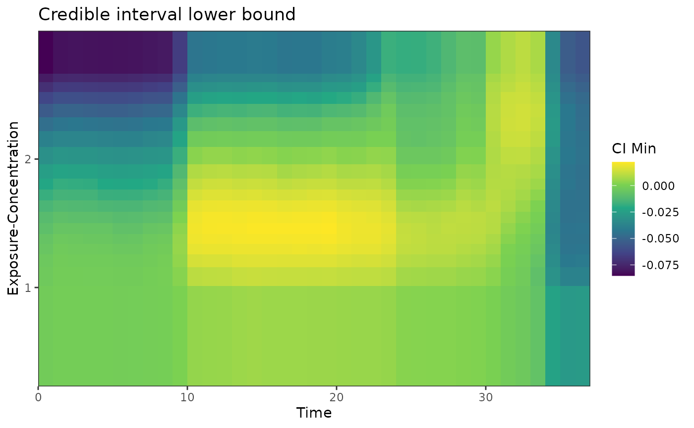

``` r

plot(tdlnm.sum, plot.type = "ci-max", main = "Credible interval upper bound")
```

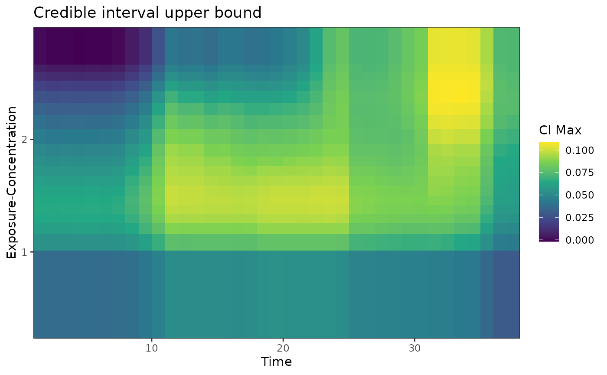

``` r

# Cumulative effect and significance
plot(tdlnm.sum, plot.type = "cumulative", main = "Cumulative effect per exposure-concentration")
```

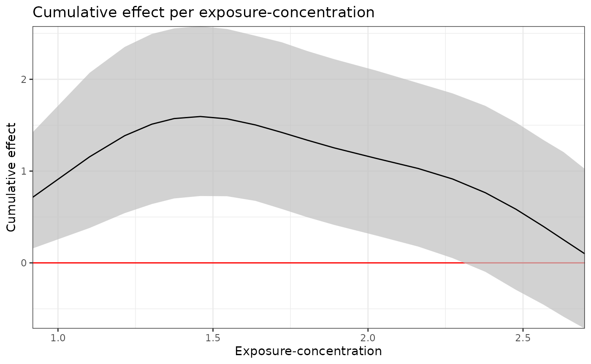

``` r

plot(tdlnm.sum, plot.type = "effect", main = "Significant effects with directions")
```

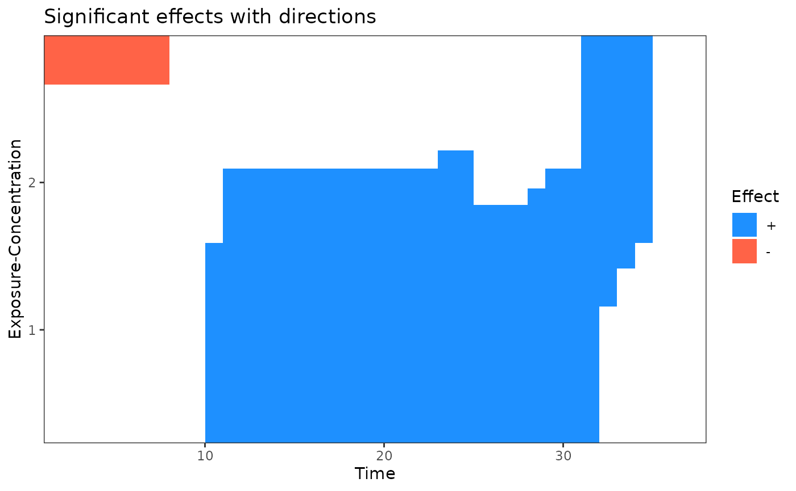
